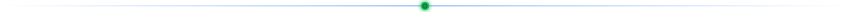
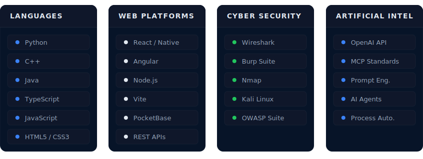
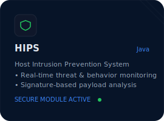
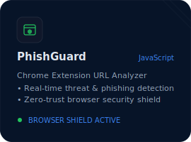
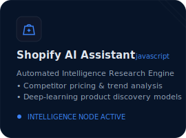
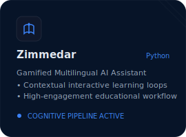
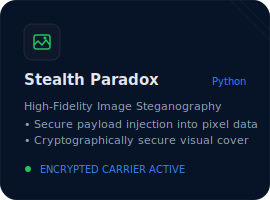
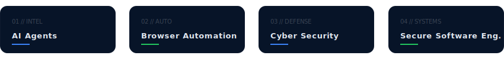

<!-- CONTAINER START -->

  <!-- 1. HERO BANNER -->
  

   

  <!-- 2. TYPING ANIMATION -->
  

   

  <!-- 3. QUICK LINKS / NAVIGATION -->
  

    
    
    
    
  

   
  
   

  <!-- 4. MISSION STATEMENT -->
  

    

      I build intelligent software at the intersection of artificial intelligence, cybersecurity, and modern engineering.
    

    

      My focus is creating secure, scalable, and practical systems that transform complex ideas into reliable products.
    

  

  
   

  <!-- 5. TECHNOLOGY STACK -->
  

    <h2 style="font-family: 'Space Grotesk', sans-serif; font-size: 20px; color: #E2E8F0; letter-spacing: 0.05em; text-transform: uppercase; margin-bottom: 24px; border-left: 3px solid #3B82F6; padding-left: 12px;">Technical Infrastructure</h2>
    
  

   
  
   

  <!-- 6. FEATURED PROJECTS -->
  

    <h2 style="font-family: 'Space Grotesk', sans-serif; font-size: 20px; color: #E2E8F0; letter-spacing: 0.05em; text-transform: uppercase; margin-bottom: 24px; border-left: 3px solid #22C55E; padding-left: 12px;">Featured Products</h2>
    
    <!-- Projects Grid Container -->
    

      
      <!-- Card 1: HIPS -->
      

      <!-- Card 2: PhishGuard -->
      

      <!-- Card 3: Shopify AI Research Assistant -->
      

      <!-- Card 4: Zimmedar -->
      

      <!-- Card 5: Stealth Paradox -->
      

    

  

   
  
   

  <!-- 7. CURRENT FOCUS -->
  

    <h2 style="font-family: 'Space Grotesk', sans-serif; font-size: 20px; color: #E2E8F0; letter-spacing: 0.05em; text-transform: uppercase; margin-bottom: 24px; border-left: 3px solid #3B82F6; padding-left: 12px;">Active Specializations</h2>
    
  

   
  
   

  <!-- 8. OPEN SOURCE & ACTIVITY -->
  

    <h2 style="font-family: 'Space Grotesk', sans-serif; font-size: 20px; color: #E2E8F0; letter-spacing: 0.05em; text-transform: uppercase; margin-bottom: 24px; border-left: 3px solid #22C55E; padding-left: 12px;">Telemetry & Contributions</h2>
    
    <!-- Row of OS Telemetry widgets (Stylized to match dark mode UI) -->
    

      
      
      

        
      

      
      <!-- Contributions Snake Game -->
      <picture>
        <source media="(prefers-color-scheme: dark)" srcset="https://raw.githubusercontent.com/Muhammad-Saim-Iftikhar/Muhammad-Saim-Iftikhar/output/github-contribution-grid-snake-dark.svg">
        <source media="(prefers-color-scheme: light)" srcset="https://raw.githubusercontent.com/Muhammad-Saim-Iftikhar/Muhammad-Saim-Iftikhar/output/github-contribution-grid-snake.svg">
        
      </picture>
    

  

   
  
   

  <!-- 9. FOOTER -->
  

    

      Build with purpose. • Secure by design. • Automate with intelligence.
    

    

      SYSTEM_STATUS: SECURE // RUN_LEVEL: 5
    

  

<!-- CONTAINER END -->
