  

---

# About

I build software where **Artificial Intelligence**, **Cyber Security**, and **Modern Engineering** intersect.

My work focuses on intelligent automation, browser technologies, defensive security, and full-stack applications that solve practical problems with simplicity and reliability.

---

# Tech Stack

### Languages

### Frameworks & Development

### Cyber Security

`Wireshark` • `Burp Suite` • `Nmap` • `Kali Linux`

### Artificial Intelligence

`OpenAI` • `MCP` • `Prompt Engineering` • `AI Automation`

---

# Featured Projects

### 🛡 HIPS

Host Intrusion Prevention System for real-time monitoring and anomaly detection.

### 🕵 PhishGuard

Chrome extension that detects phishing websites and analyzes suspicious URLs.

### 🤖 Shopify AI Research Assistant

AI-powered research platform for discovering winning e-commerce products.

### 🌍 Zimmedar

Gamified civic education platform with AI assistance and multilingual support.

### 🔒 Stealth Paradox

Browser-based steganography application for secure image communication.

---

# Currently Exploring

- AI Agents
- Browser Automation
- Offensive Security
- Secure Software Engineering
- Intelligent Developer Tools

---

---

### Build with purpose.

### Secure by design.

### Automate with intelligence.

